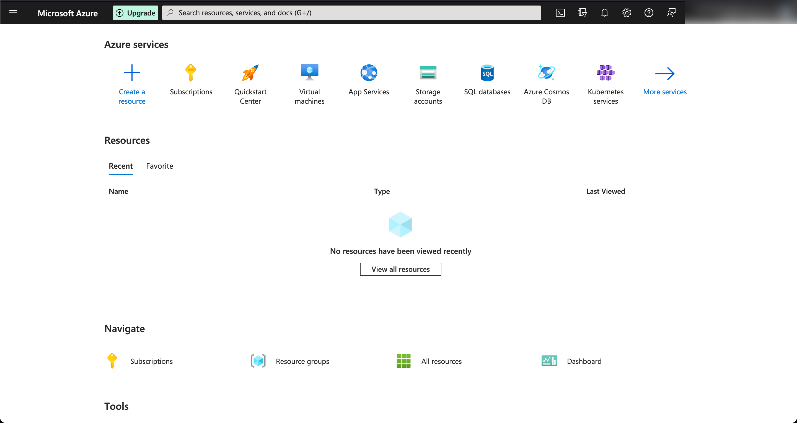

# SIEM Honeypot Lab

(picture of heatmap goes here)

## TL;DR

In this lab, I created a honeypot virtual machine in the cloud and collected information about failed remote login attempts using a SIEM. Using Azure Sentinel, I plotted a heatmap of the attackers' locations on a world map to visualize where the attacks were coming from.

Below, I've documented a comprehensive outline detailing a four-stage process. The following step-by-step guide is designed to facilitate seamless progression from start to finish.

## Introduction

First, let's define a couple of key terms

* **Honeypot:** A computer system that is intentionally made vulnerable to attract cyberattacks. It acts as a decoy, and is used to gain information about cybercriminals and their attack vectors. In this lab, we will deploy a Windows 10 virtual machine as our honeypot.
* **SIEM (Security Information and Event Management):** Software that collects computer logs and reports any unusual or suspicious activity.

Next, let's break down what we'll be doing :

1.

## Stage 1: Setting Up Our Environment

First, we will need to create a Microsoft Azure account. Microsoft offers new users $200 in Azure for free! You can sign up for your $200 in Azure credit here: [https://azure.microsoft.com/en-us/free/](https://azure.microsoft.com/en-us/free/)

After creating an Azure account, you should be directed to the Azure dashboard

<figure><figcaption>
Azure Dashboard
</figcaption></figure>

