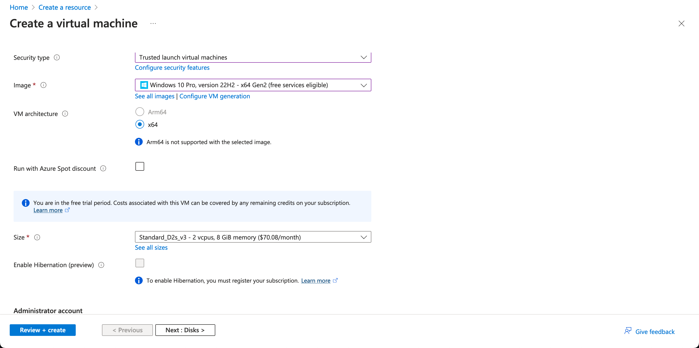

# SIEM Honeypot Lab

(picture of heatmap goes here)

## TL;DR

In this lab, I created a honeypot virtual machine in the cloud and collected information about failed remote login attempts using a SIEM. Using Azure Sentinel, I plotted a heatmap of the attackers' locations on a world map to visualize where the attacks were coming from.

Below, I've documented a comprehensive outline detailing a four-stage process. The following step-by-step guide is designed to facilitate seamless progression from start to finish.

## Introduction

First, let's define a couple of key terms

* **Honeypot:** A computer system that is intentionally made vulnerable to attract cyberattacks. It acts as a decoy, and is used to gain information about cybercriminals and their attack vectors. In this lab, we will deploy a Windows 10 virtual machine as our honeypot.
* **SIEM (Security Information and Event Management):** Software that collects computer logs and reports any unusual or suspicious activity.

Next, let's break down what we'll be doing :

1.

## Stage 1: Setting Up Our Environment

First, we will need to create a Microsoft Azure account. Microsoft offers new users $200 in Azure for free! You can sign up for your $200 in Azure credit here: [https://azure.microsoft.com/en-us/free/](https://azure.microsoft.com/en-us/free/)

### Creating our Virtual Machine (VM) in Azure

After creating an Azure account, you will be directed to the Azure dashboard

<figure><figcaption>
Azure Dashboard
</figcaption></figure>

At the top of the dashboard, click **Create a resource**. You will be brought to a panel that displays the resources that Azure provides.

<figure><figcaption></figcaption></figure>

Under **Virtual Machine**, select **Create**.

We will need to enter some information about our VM before it can be deployed:

* **Resource Group:** honeypotlab

_We will need to create a new resource group to add our VM to. Select **Create new** under the **Resource Group** text box, and enter "honeypotlab"._

<figure><figcaption></figcaption></figure>

* **Virtual machine name:** honeypot-vm
* **Region:** (Pick the region closest to your physical location)
* **Image:** Windows 10 Pro x64
* **Username:** (A username you can remember)
* **Password:** (A password you can remember)

The rest of the fields can be left as their default values.&#x20;

Once all of the fields have been updated, your configuration should look something like this:

<figure><figcaption></figcaption></figure>

<figure><figcaption></figcaption></figure>

<figure><figcaption></figcaption></figure>

<figure><figcaption></figcaption></figure>

Next, scroll up to the top and select **Networking**.

Under the **Networking** tab, we will be modifying the **NIC network security group** field.&#x20;

Select the **Advanced** radio button. Some new options will appear.

<figure><figcaption></figcaption></figure>

Under the combo box next to the **Configure network security group** field, select **Create new**.&#x20;

You view all of the active firewall rules for the VM we are creating. &#x20;

<figure><figcaption></figcaption></figure>

