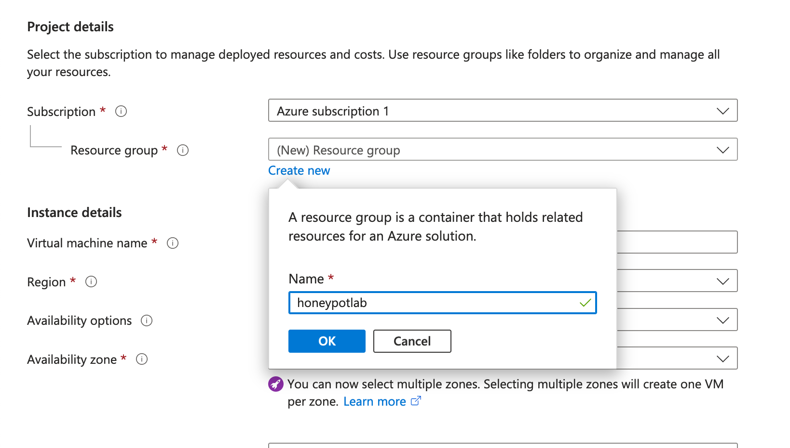
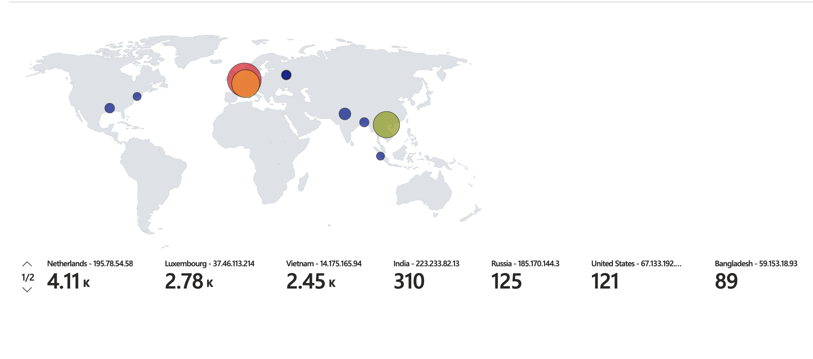

# SIEM Honeypot Lab

<figure><figcaption></figcaption></figure>

##

## &#x20;TL;DR

_**Technologies used**: Virtual Machines, Azure Log Analytics Workspace, Azure Sentinel (SIEM), PowerShell, Kusto Query Language (KQL), Geolocation API_

In this lab, I created a honeypot virtual machine in the cloud and collected information about failed remote login attempts using Azure's **Log Analytics Workspace** Service. Finally, I used **Azure Sentinel** to process the logs and plot a heatmap of the attackers' locations on a world map to visualize where the attacks were coming from.

<figure><figcaption><p>Project Overview</p></figcaption></figure>

Below, I've documented a comprehensive outline detailing a four-stage process. The following step-by-step guide is designed to facilitate seamless progression from start to finish.

## Table Of Contents

[#introduction](./#introduction "mention")

[#stage-1-setting-up-our-cloud-environment](./#stage-1-setting-up-our-cloud-environment "mention")

[#stage-2-establishing-a-pipeline-from-honeypot-to-azure](./#stage-2-establishing-a-pipeline-from-honeypot-to-azure "mention")

[#stage-3-plotting-attackers-locations-on-a-world-map](./#stage-3-plotting-attackers-locations-on-a-world-map "mention")

[#finalization](./#finalization "mention")

[#results](./#results "mention")

[#takeaways](./#takeaways "mention")

## Introduction

First, let's define a couple of key terms:

* **Honeypot:** A computer system that is intentionally made vulnerable to attract cyberattacks. It acts as a decoy, and is used to gain information about cybercriminals and their attack vectors. In this lab, we will deploy a Windows 10 virtual machine as our honeypot.
* **SIEM (Security Information and Event Management):** Software that collects computer logs and reports any unusual or suspicious activity.

Next, let's break down what this lab includes. This lab has three stages:

1. &#x20;Setting Up Our Cloud Environment
2. &#x20;Establishing A Pipeline From Honeypot To Azure
3. Plotting Attackers' Locations On A World Map

If that sounds interesting to you, and you want to know more, feel free to continue reading.

## Stage 1: Setting Up Our Cloud Environment

First, we will need to create a Microsoft Azure account. Microsoft offers new users $200 in Azure for free! You can sign up for your $200 in Azure credit here: [https://azure.microsoft.com/en-us/free/](https://azure.microsoft.com/en-us/free/)

### 1.1 Creating our Virtual Machine (VM) in Azure

Our honeypot will be an extremely vulnerable VM hosted in the cloud. We will need an azure account to creat our VM, as well as a few other cloud resources that will be used throughout the duration of this lab.

After creating an Azure account, you will be directed to the Azure dashboard.

<figure><figcaption><p>Azure Dashboard</p></figcaption></figure>

At the top of the dashboard, click **Create a resource**. You will be brought to a panel that displays the resources that Azure provides.

<figure><figcaption></figcaption></figure>

Under **Virtual Machine**, select **Create**.

We will need to enter some information about our VM before it can be deployed:

* **Resource Group:** honeypotlab

_We will need to create a new resource group to add our VM to. Select **Create new** under the **Resource Group** text box, and enter "honeypotlab"._

<figure><figcaption></figcaption></figure>

* **Virtual machine name:** honeypot-vm
* **Region:** (Pick the region closest to your physical location)
* **Image:** Windows 10 Pro x64
* **Username:** (A username you can remember)
* **Password:** (A password you can remember)

The rest of the fields can be left as their default values.&#x20;

Once all of the fields have been updated, your configuration should look something like this:

<figure><figcaption></figcaption></figure>

<figure><figcaption></figcaption></figure>

<figure><figcaption></figcaption></figure>

<figure><figcaption></figcaption></figure>

Next, scroll up to the top and select **Networking**.

Under the **Networking** tab, we will be modifying the **NIC network security group** field.&#x20;

Select the **Advanced** radio button. Some new options will appear.

<figure><figcaption></figcaption></figure>

Under the combo box next to the **Configure network security group** field, select **Create new**.&#x20;

Here, we will be able to modify the firewall rules for the VM we are creating. &#x20;

<figure><figcaption></figcaption></figure>

Remove the default security group by clicking the blue trash can on the right side of the screen.

Next, we will make a new inbound rule by clicking **Add an inbound rule**.

A panel will appear on the right side of your screen, allowing us to specify the rules of our new security group. We will keep all of the default values the same, but change the D**estination port ranges** field to "**\***"

<figure><figcaption></figcaption></figure>

"**\***" acts as a wildcard, The rule parameter shown above will allow all network traffic to establish a connection with out VM.

Confirm our rule by selecting **Add** at the bottom.

Now, we can see our new inbound rule in our security group.

<figure><figcaption></figcaption></figure>

Select **OK** at the bottom of the screen to confirm our new security group.

Finally, at the bottom of the screen, select **Review + Create.**

Your new VM may possibly go through a validation process, wait for the validation process to finish, and select **Create** at the bottom of the screen.

After our VM is created, it may take a while to be fully deployed. While we wait, we can set up our Log Analytics Workspace.

### 1.2 Setting Up Our Log Analytics Workspace

To export our VM's logs to Azure we will need to create a logs analytics workspace within Azure.

In the search bar at the top of the screen, search for "log analytics workspaces", and select the first option that appears.

<figure><figcaption></figcaption></figure>

Once you are brought to the Logs Analytics workspaces dashboard, select **Create log analytics workspace.**

When creating our new logs analytics workspace, make sure to use out **honeypotlab** resource group, and select the region that is closest to you. the rest of the values don't matter much.&#x20;

<figure><figcaption></figcaption></figure>

Select **Review + Create** at the bottom of the screen.

Next, we have to connect our virtual machine to our log analytics workspace, so we can extract our VM's logs into Azure for processing.

In the log analytics workspace left sidebar, scroll down to V**irtual machines**.&#x20;

<figure><figcaption></figcaption></figure>

Select our VM from the list, and click **Connect**.

It may take a while to connect our log analytics workspace to our VM. You will receive a notification when the process is done.

<figure><figcaption></figcaption></figure>

Once our VM and our log analytics workspace are properly connected, we can move on to setting up Azure Sentinel which will act as our SIEM.

### 1.3 Setting Up Our SIEM

To process our logs into a digestible format, we'll use Microsoft Sentinel as a SIEM.

In the Azure resources search bar at the top of the screen, search for "Microsoft Sentinel".

<figure><figcaption></figcaption></figure>

Select **Microsoft Sentinel** under Services, then select **Create Microsoft Sentinel**.

You will be redirected to the **Add Microsoft Sentinel to a workspace** page. Select the log analytics workspace that we created in step 1.2.

<figure><figcaption></figcaption></figure>

Click **Add** at the bottom of the screen to complete the Microsoft Sentinel setup.

## Stage 2: Establishing A Pipeline From Honeypot To Azure

Great! Our environment Seyup is complete. Next, we need to establish a pipeline between our VM and Azure so we can monitor any failed login attempts within Azure.

&#x20;We will accomplish this by using a PowerShell Script that will run locally on the VM. It will monitor all Windows logs relating to remote login attempts, and export any useful information to an output file that Azure can use to process the data.

### 2.1 Configuring Our Honeypot

Let's start by remotely logging into our virtual machine.

In the Azure Resources search box at the top of the screen, search for "virtual machines", and select the **Virtual machines** service.

<figure><figcaption></figcaption></figure>

Here, we can see a list of virtual machines that have been created. Click the name of the the VM that we created in stage 1.1

<figure><figcaption></figcaption></figure>

In the Virtual machine overview pane, take note of the **Public IP address**. My VM's Public IP is 172.178.95.126

<figure><figcaption></figcaption></figure>

We can use this IP address to log into our VM via a remote desktop client. On Windows 10, this can be accomplished by following these steps:

1. Search for "Remote Desktop Connection", in the start menu
2. Hit **Enter**
3. Enter our VM's Public IP address into the **Computer:** field
4. Click **Connect**
5. Enter the username and password that you specified for your VM in stage 1.1
6. Select **OK**
7. Accept any certificates that may be required for the connection

On Mac/Linux you will have to use third-party to connect to our virtual machine.

If all goes well, we should be able to see the desktop on our virtual machine.

<figure><figcaption></figcaption></figure>

First, we'll need to disable Windows Defender Firewall on our VM. Disabling the firewall will allow attackers to try to establish connections with our honeypot.

Inside of the VM:

1. Open the **Start Menu**.
2. Search for "wf.msc"
3. Hit **Enter.**

The Windows Defender Firewall window will appear. On the right side panel, click **Properties**. A new pop-up window will appear.

In the **Domain Profile** tab, set the **Firewall State** to **Off**.

<figure><figcaption></figcaption></figure>

Repeat the same process for the P**rivate Profile** and **Public Profile** tab.

Select **OK**.

Now, our VM won't drop any network traffic from potential attackers

### 2.2 Extracting Custom Logs

Now we'll implement a PowerShell script to parse the logs of failed login attempts and export them to a file that Azure can read.

1. Open **PowerShell ISE** (**Start Menu > "Windows PowerShell ISE"**)
2. Create. a new file (**File > New)**
3. Copy the following PowerShell script into the text editor that appears: [https://github.com/joshmadakor1/Sentinel-Lab/blob/main/Custom\_Security\_Log\_Exporter.ps1](https://github.com/joshmadakor1/Sentinel-Lab/blob/main/Custom\_Security\_Log\_Exporter.ps1)
4. Get a free API key from ipgeolocation.io (this API key be used to translate IP addresses of attackers to their physical locations)

**Note**: getting the free version of the API will only allow up to 1000 requests per day.  If you have the extra money, you may want to spend $15 on the bronze tier subscription for one month. This subscription will give you 150,000 API calls per month, which is more than enough for this lab.

5. Enter your API key in the `$API_KEY` variable (line 2)
6. Save the file as "log\_exporter.ps1" to your Desktop
7. Click the **Run** button (Green play button) on the toolbar to run the script.

<figure><figcaption></figcaption></figure>

While this script is running Anytime a failed login occurs, the script will output information about the failed login in the output pane at the bottom

<figure><figcaption><p>Take note of the purple output at the bottom</p></figcaption></figure>

This script will also write this data to "**C:\ProgramData\failed\_rdp.log**" in the local VM. That will be the log file that we use to export our custom logs to Azure.

### 2.3 Configuring Custom Logs In Azure

Next, we will have to configure our custom logs in Azure. To properly set up a pipeline between our VM and Azure, we will have to make some configuration changes to our log analytics workspace

Navigate back to the log analytics workspace that we created back in stage 1.2 within the Azure portal.

&#x20;In your log analytics workspace panel, select **Tables** on the right side-panel,&#x20;

&#x20;Click **Create > New custom log (DCR-based)**

<figure><figcaption></figcaption></figure>

The custom log wizard will then ask for a sample log from the user. This sample file will be used to train or log analytics workspace to know what to look for when parsing our custom logs.

Luckily, the PowerShell script that we ran in stage 2.2 has generated sample data for us, we just need to copy the contents of our output file from our VM to our local machine.

1. Inside of the VM, navigate to "**C:\ProgramData\failed\_rdp.log**". (Note that the **ProgramData** folder is hidden by default).
2. Copy the contents of that **failed\_rdp.log** to a new text file on your local machine. This file exists outside of our VM and on our main computer.

<figure><figcaption><p>Contents of my log export file on my local machine.</p></figcaption></figure>

3. Upload the new text file to the custom log wizard

<figure><figcaption></figcaption></figure>

Select **Next** at the bottom of the screen.

The custom log wizard will ask for a specific delimiter. Ensure that **New line** is selected, and click **Next**.

In the next tab (**Collection paths**), we will need to input the path of our output log file in the VM. This is how Azure will be fed new information about failed RDP login attempts.

1. Select "Windows" from the **Type** combo box.
2. Enter "**C:\ProgramData\failed\_rdp.log**" in the **Path** text field.

<figure><figcaption></figcaption></figure>

Click **Next** at the bottom of the screen.

In the **Details** panel, we can enter "FAILED\_RDP\_WITH\_GEO" as the custom log name, and click **Next**.

You will be directed to a summary screen, click **Create**.

Great!, now all of our rules should be set up. To confirm that our pipeline is working correctly, we can navigate to **Logs** in the left side panel in our log analytics workspace , and query the table `FAILED_RDP_WITH_GEO`

Sure enough, we can see our log data in the **RawData** column in our table.&#x20;

**Note**: This new table may not be immediately available after creating our custom log. Allow up to an hour for Azure to create the pipeline between our VM and Log Analytics workspaces

<figure><figcaption></figcaption></figure>

### 2.4 Data Cleaning

Next, we will have to create custom columns to partition the data in our logs. As it is right now, all of our data is combined into one column, which does not allow us to do much with it. Let's separate our data into different columns so that longitude and latitude attributes have their own columns, The ip\_address attribute has its own column, etc.

We can partition our parameters by using the following KQL query:

```clike
FAILED_RDP_WITH_GEO_CL
| extend username = extract(@"username:([^,]+)", 1, RawData),
         timestamp = extract(@"timestamp:([^,]+)", 1, RawData),
         latitude = extract(@"latitude:([^,]+)", 1, RawData),
         longitude = extract(@"longitude:([^,]+)", 1, RawData),
         sourcehost = extract(@"sourcehost:([^,]+)", 1, RawData),
         state = extract(@"state:([^,]+)", 1, RawData),
         label = extract(@"label:([^,]+)", 1, RawData),
         destination = extract(@"destinationhost:([^,]+)", 1, RawData),
         country = extract(@"country:([^,]+)", 1, RawData)
 | where destination != "samplehost"
 | where sourcehost != ""
 | summarize event_count=count() by timestamp, label, country, state, sourcehost, username, destination, longitude, latitude
```

<figure><figcaption><p>Formatted log data</p></figcaption></figure>

Great! Now that we have cleaned our data, It's time to process it into a more digestible format.

## Stage 3: Plotting Attackers' Locations On A World Map

Great! Now that we have cleaned our data, It's time to process it into a more digestible format.

Using the Azure Resources search bar at the top of the screen, navigate to **Microsoft Sentinel.**

<figure><figcaption></figcaption></figure>

Select our log analytics workspace from the list

<figure><figcaption></figcaption></figure>

From the **Microsoft Sentinel** left side panel, select **Workbook > Add a workbook**

Click **Edit** from the toolbar at the top.

We can remove the two default widgets since we won't be needing them. Navigate to the **three dots** next to both widgets and click **Delete**.

<figure><figcaption></figcaption></figure>

We now have an empty workbook that we can use as our heatmap.

Select the **Add** dropdown, and click **Add query**.

We will use the  KPL query from before as a data source for our new widget. Enter the KPL query in the text box.&#x20;

Next, set the **Visualization** combo box to **Map.** In the **Map Settings** side panel, scroll down to the **Metric label** field, and set the value to "**label**".&#x20;

<figure><figcaption></figcaption></figure>

As you can see, in the time it took me to set up this map, I have already gotten a few attacks from Europe, and The US east coast.

We are done configuring our map, so we can save it.

Click the **Save** button at the top of the toolbar to name the new workbook and assign it a resource group, then click **Apply**.

<figure><figcaption></figcaption></figure>

## Finalization

At this point, our home-lab in the cloud is completely autonomous. We can just sit back, relax, and watch our world map as the attacks come in.

It doesn't take long for the red-hatters of the internet to find exposed machines on the public internet. You can leave this running in the cloud, and within 24 hours, you will have a colorful map with attacks from all around the world.

As a reminder, when you are satisfied with your heat map, remember to shut down the **honeypotlab** resource group. All of these cloud resources can be quite expensive, and you definitely don't want any surprises at the end of the billing period.


## Results

### Results After 12 hours

<figure><figcaption></figcaption></figure>

### IResults After 24 Hours


### Results After 1 Week


## Takeaways

Before I even completed this lab, attacks already started rolling into The map, and That was only about 2 hours after deploying my virtual machine. I've definitely learned that It doesn't take long for the internet to find vulnerable systems on the public internet.

Additionally, after completing this lab, I will never be using common usernames such as:

* administrator
* admin
* user
* guest
* PC

a majority of the failed RDP login attempts were using one of these usernames, and trying hundreds or even thousands of passwords for each. If I had used one of these usernames, there would've been a much higher chance of my honeypot getting breached.

### Room For Improvement...

#### Powershell May Not Be The Best Solution for Exporting Security Logs

Using a PowerShell Script to collect information about failed RDP login attempts was more of a quick-and-dirty solution. Perhaps it would have been more of a streamlined process if I used software that was made for log collection such as Splunk.

#### Only The Tip Of The Iceberg

As it is, the heat map only shows data from failed RDP login attempts. However, SMB is open by default on Azure cloud VMs. There are most certainly other attacks happening to our system other than RDP credential brute-forcing. Attackers may be trying to brute-force SMB credentials as well,  but I didn't want to collect too many logs at once, as that would use up all of my IP geolocation API requests.

### Technical Skills Learned

**Microsoft Azure Cloud:** Before this lab, I was completely new to Azure Cloud. I learned how to combine multiple services with Azure to accomplish a specific task that I want to.

**PowerShell**: I had very little experience with PowerShell before this lab. Using Powersheel to read system logs on a local machine was definitely a learning experience

**Kusto Query Language (KQL):** I had never even heard of KPL before completing this lab. Using Azure's query language to clean the log data within Azure definitely took longer than expected, but it was well worth it.

